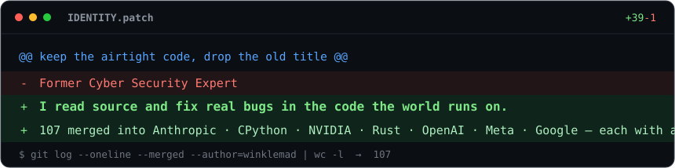

# Madan Kumar



I hunt for subtle correctness, security, and API-contract bugs by *reading the code* — then ship the fix with a regression test. So far that's **16 merged pull requests** into projects owned by **OpenAI, Meta, Microsoft, Google, Unsloth, Mistral, Vue, Prefect, jq, and pydantic**, with **60+ more in review** across nearly 50 organizations — in **Python, TypeScript, Java, Rust, Go, and C**.

No typo fixes. Every one below is a real defect with a reproduction and a test.

```diff
@@ every fix below is a real bug — reproduced red, shipped green, with a test @@
- openai/agents: forwarded top_logprobs but never set logprobs=True → API 400
+ set logprobs=True whenever top_logprobs is present                 ✔ merged
```


## 🚀 Selected merged contributions

| Project | Org | What was broken |
|---|---|---|
| [openai-agents-python #3763](https://github.com/openai/openai-agents-python/pull/3763) | **OpenAI** | Chat Completions provider forwarded `top_logprobs` but never set `logprobs=True` → the API rejected it with a 400 (the Responses path handled it correctly). |
| [openai-agents-js #1451](https://github.com/openai/openai-agents-js/pull/1451) | **OpenAI** | Deserializing a `RunState` dropped token `usage` → resumed runs silently under-reported usage (a billing bug). |
| [xformers #1402](https://github.com/facebookresearch/xformers/pull/1402) | **Meta** | The attention profiler over-counted `softmax@V` FLOPs for non-square causal masks. |
| [DeepSpeed #8145](https://github.com/deepspeedai/DeepSpeed/pull/8145) | **Microsoft** | `DeepSpeedInferenceConfig` crashed on a legacy boolean MoE value that its own backward-compat path was meant to accept. |
| [timesfm #463](https://github.com/google-research/timesfm/pull/463) | **Google** | Quantile-flip invariance wasn't applied to the autoregressive branch → corrupted forecast bands past horizon 128 (mean/median hid it). |
| [carapaceproxy #614](https://github.com/diennea/carapaceproxy/pull/614) | **Security · Java** | Absolute-form request URIs bypassed a path-anchored ACL deny rule (CWE-436 / CWE-863) — an auth bypass. |
| [pydantic #13428](https://github.com/pydantic/pydantic/pull/13428) | **pydantic** | `__hash__` on `WithJsonSchema` / `Examples` ignored the `mode` value → hash collisions between distinct schemas. |
| [unsloth #7073](https://github.com/unslothai/unsloth/pull/7073) | **Unsloth** | `SyntheticDataKit.chunk_data` emitted chunks over the requested `max_tokens` limit. |
| [mistral-common #262](https://github.com/mistralai/mistral-common/pull/262) | **Mistral** | The `seed` field was dropped when bridging a `SpeechRequest` into the OpenAI request format. |
| [pinia #3162](https://github.com/vuejs/pinia/pull/3162) | **Vue** | Store hydration *unioned* incoming reactive `Set` / `Map` state into the existing value instead of replacing it → stale entries survived hydration. |
| [fastmcp #4492](https://github.com/PrefectHQ/fastmcp/pull/4492) | **Prefect** | `compress_schema` mutated the caller's schema object in place → unexpected side effects on the passed-in data. |
| [coreutils #13439](https://github.com/uutils/coreutils/pull/13439) | **uutils · Rust** | `paste -s -d` didn't restart the delimiter cycle for each file → output diverged from GNU coreutils. |
| [htop #2046](https://github.com/htop-dev/htop/pull/2046) | **htop · C** | A reset-on-fork scheduling flag was combined with `&=` instead of `\|=`, zeroing the scheduling policy every time it was set. |
| [psycopg #1373](https://github.com/psycopg/psycopg/pull/1373) | **psycopg · Python** | Two `DataError` messages were missing the `f` prefix, so the `{...}` placeholders printed as literal braces instead of the offending values. |
| [novu #11984](https://github.com/novuhq/novu/pull/11984) | **Novu** | The digest name filter rendered "and 0 others" when `maxNames` already covered every item, instead of omitting the suffix. |
| [jq #3586](https://github.com/jqlang/jq/pull/3586) | **jq · C** | A zero-width global regex match advanced by one code unit instead of the whole Unicode codepoint, so `["🚀" \| match(""; "g")] \| length` miscounted multi-byte characters. |

## 🔬 Currently in review

Open fixes at **NVIDIA · Apple · Anthropic · Google DeepMind · Hugging Face · Redis · Qdrant · Spotify · Supabase · scikit-learn · vLLM · Ollama · Keras · MLflow · OpenSearch** and more.

**[→ See all open pull requests](https://github.com/search?q=author%3Awinklemad+is%3Apr&type=pullrequests)**

## 🚀 Beyond bug fixes — a product I shipped solo

**PhantomAI** — a **multichannel LLM gateway** built end to end in **under 90 days**. One workspace (plus a REST API) that routes across **9 model providers** — OpenAI, Anthropic, Google, Mistral, DeepSeek, xAI, Azure, OpenRouter, and Ollama — with streaming responses, isolated per-user API keys, and a Stripe-metered, per-model credit-billing system.

- **Frontend:** React 18 · Vite · TypeScript · shadcn-ui / Tailwind · Next.js marketing site
- **Backend & data:** Supabase (Postgres, row-level security, Edge Functions) · Stripe billing · deployed on Vercel

## 🛠️ What I work in

- **Languages:** Python · TypeScript / JavaScript · Rust · Go · Java
- **Domains:** AI / ML infrastructure · LLM & agent tooling · databases · backend APIs · data engineering · systems · application security
- **How I work:** read the source → reproduce red → fix the whole bug *class* → prove it with a test → ship.

## 📊 GitHub activity

<p>
  
  
</p>

## 💜 Support my work

If my fixes have helped a project you rely on, you can [sponsor me on GitHub](https://github.com/sponsors/winklemad). It funds more time spent reading source and shipping fixes upstream.

## 📫 Reach me

<p>
  <a href="https://www.linkedin.com/in/winklemad/"></a>
  <a href="https://x.com/winklemad"></a>
  <a href="https://winklemad.github.io"></a>
  <a href="https://github.com/sponsors/winklemad"></a>
  <a href="mailto:winklemad@outlook.com"></a>
</p>

<!--
  ── Optional: uncomment to add live GitHub stats cards (they render on GitHub) ──
  
  
-->
